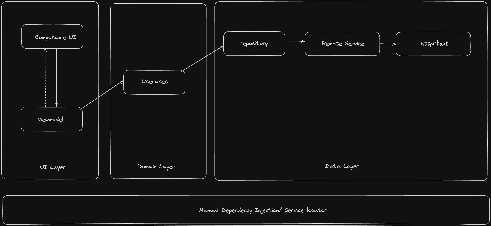

# Documentation

## Directory structure
```
.
└── instastories
    ├── Data.kt
    ├── MainActivity.kt
    ├── data
    │   ├── remote
    │   │   ├── StoriesService.kt
    │   │   └── injector
    │   │       ├── OkHttpClientProvider.kt
    │   │       └── RemoteServiceProvider.kt
    │   └── repositories
    │       └── StoryRepository.kt
    ├── domain
    │   ├── injector
    │   │   ├── RepositoryProvider.kt
    │   │   └── UseCasesProvider.kt
    │   ├── models
    │   │   └── Story.kt
    │   └── usecases
    │       └── GetStoriesRemoteUseCase.kt
    ├── server
    │   └── EmbeddedServer.kt
    ├── ui
    │   ├── features
    │   │   ├── AppNavigation.kt
    │   │   ├── storiesHome
    │   │   │   ├── StoriesScreen.kt
    │   │   │   ├── StoryViewModel.kt
    │   │   │   └── components
    │   │   │       └── CircularUserIcon.kt
    │   │   └── storiesPreview
    │   │       ├── StoriesPreviewScreen.kt
    │   │       ├── StoryPreviewViewModel.kt
    │   │       └── component
    │   │           ├── AutoScrollIndicator.kt
    │   │           ├── AutoScrollingPager.kt
    │   │           └── CrossIcon.kt
    │   ├── injector
    │   │   └── AppInjector.kt
    │   └── theme
    │       ├── Color.kt
    │       ├── Theme.kt
    │       └── Type.kt
    └── utils
        ├── Extensions.kt
        └── TestTags.kt

```

## Architecture


The `instastories` application follows a structured architecture to ensure modularity and maintainability:

- **Data Layer**: Manages remote data access via `StoriesService` and repositories like `StoryRepository`, with dependency injection provided by `OkHttpClientProvider` and `RemoteServiceProvider`.
- **Domain Layer**: Contains core business logic, including use cases such as `GetStoriesRemoteUseCase`, and domain models like `Story`. Dependency injection is handled by `RepositoryProvider` and `UseCasesProvider`.
- **Server**: Includes `EmbeddedServer` for backend operations.
- **UI Layer**: Composed of feature-specific screens and view models, such as `StoriesScreen` and `StoryViewModel`, with UI components and themes.
- **Utils**: Provides extension functions and test tags for enhanced functionality.

## Dependency Injection
Application is small level therefore isnt require complex solutions such
as koin or Dagger/hilt, 

Implemented manual DI I explain more about it [here](https://proandroiddev.com/hold-on-before-you-dagger-or-hilt-try-this-simple-di-f674c83ebeec)

## Server 

In this application, I have embedded a Ktor server within the app itself. It automatically starts in `MainActivity`'s `onCreate` method and stops in `onDestroy`. To test it, simply install the application and visit [http://localhost:8080/chetan/api/stories](http://localhost:8080/chetan/api/stories) from your mobile chrome browser. 

You can learn more about Ktor [here](https://ktor.io/docs/server-create-a-new-project.html).


## UI features

### Functional Requirements
Implement the following features:
- [x] A list of stories should be visible in a smaller view in a horizontally scrollable list.
- [x] The data for stories should be served by a backend API.
- [x] User should be able to start viewing one of the available stories from list.
- [x] Stories should automatically advance to the next one after a set duration (say 5 seconds).
- [x] The user should be able to manually navigate between stories using UI controls. Tapping on the left
  side of an open story should take
- [x] the user to the previous story. Tapping on the right side of an open story should take the suer to
  the next story.
- [x] Use animations or transitions for smoother story transitions and UI interactions.

### Non-Functional Requirements
- [x] Performance - stories should load smoothly without any delay from the backend or observable delay in loading of images.
- [x] Tests - Write Integration tests for this feature.
- [x] Caching - Write a service to cache the API response.

### Technical Requirements
- [x] Language: Kotlin
- [x] Framework: Native Android
- [x] Testing Framework: Feel free to use any testing framework of your choice.
- [x] CI/CD Pipelines: use any service of your choice to run tests on every push.

